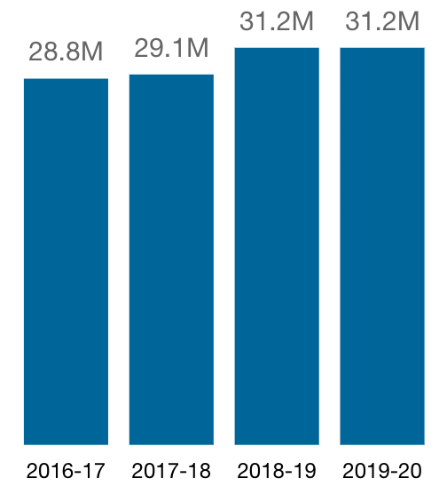

<dl class="dl-horizontal">
  <dt>Department:</dt>
  <dd>Canada Revenue Agency</dd>
  <dt>Service name:</dt>
  <dd>Individual Income Tax Returns</dd>
  <dt>Service description:</dt>
  <dd>Generally, individual taxpayers are required to file an income tax return each year. CRA provides support, information and systems enabling the taxpayer to file, processes the return, and issues a paper or electronic notice that reflects the assessment results. Debit notices will include a request for payment and credit notices where no direct deposit is set up will include a refund cheque. CRA, taxpayer, and representative initiated reassessments may occur.</dd>
  <dt>Service fees:</dt>
  <dd>This service does not have any service fees.</dd>
</dl>

## Related task performance on Canada.ca (September 2021)

| Task | Successful completion | Since last survey | 
| --- | --- | --- |
| Get a copy of a notice of assessment or reassessment | 68% | +0.2% |
| See my T4 information | 60% | No change |
| Check online mail | 71% | No change | 
| Open a My Account | 44% | -0.3% |
| Find out when I can expect my tax refund | 60% | -1.1% |
{: .wb-table.table.table-striped.table-hover.dataTable.no-footer}

## Online availability of services and total applications
If all the applicable components for a specific service are available online, that service is considered fully online.

The total number of applications shows how often people or businesses applied for this service through all possible channels, such as online, by mail, over the telephone, in-person and by fax.

### What components of this service are available online?

| Component of this service | Online status |
| --- | --- |
| A person or business can register a person, place or thing online | Yes |
| A person or business can authenticate themselves online | Yes |
| A person or business can apply online for this service | Yes |
| A person or business can be informed of the department’s decision online or through an electronic format | Yes |
| A person or business can be issued documentation online | Yes |
| A person or business can provide feedback online | Yes |
{: .table.table-striped}

### Total number of Applications

Percent of total applications that take place online 87%

## Summary of service standard performance

| Service standard | Channel | Target | Result |
| --- | --- | --- | --- |
| Our goal is to issue a notice of assessment within eight weeks of receiving a paper individual income tax return | Other | 95% | 98% |
| Our goal is to issue a notice of assessment within two weeks of receiving your digital individual income tax return. | Online | 95% | 98% |
{: .wb-table.table.table-striped.table-hover.dataTable.no-footer}

### Service standards performance

2 / 2

Service standard targets were met

  <h2>Note:</h2>
  
Results will be ‘ND’ when there is no data to report. 0% indicates that the services did not meet their standards.

